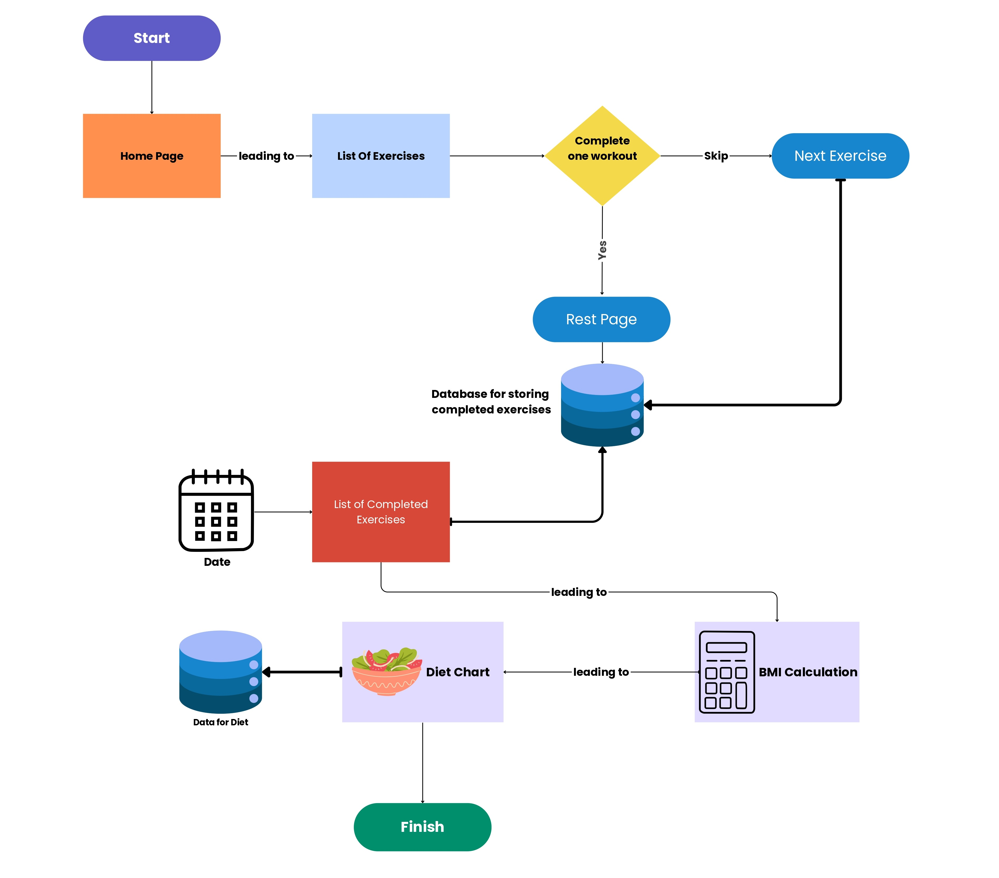
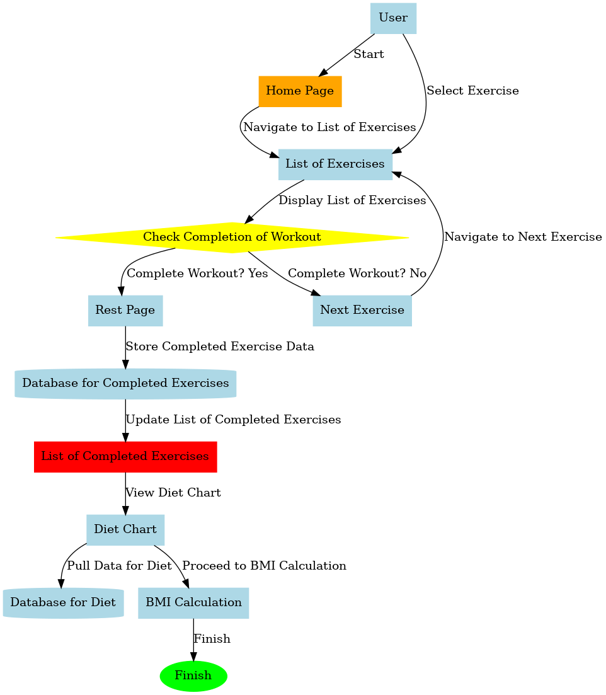
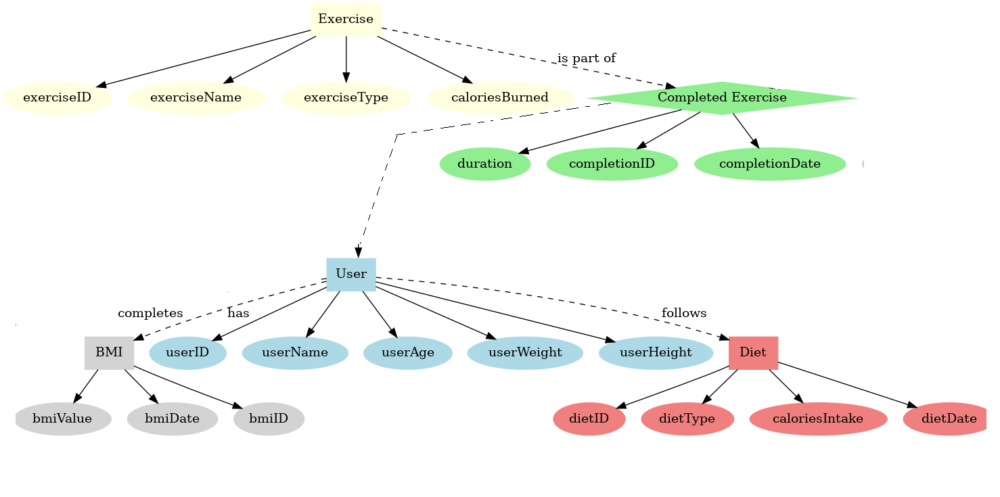
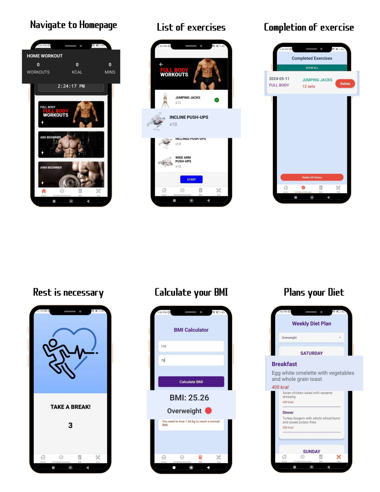

# FitSphere: Fitness App with React Native

## Project Overview
FitSphere is a fitness application designed using React Native, focusing on Android OS. It aims to help users, particularly CSE engineers and chair-oriented workers, maintain a consistent exercise routine to combat health issues arising from a sedentary lifestyle.

## Table of Contents
1. [Introduction](#introduction)
2. [Problem Statement](#problem-statement)
3. [Background & Conceptual Framework](#background--conceptual-framework)
4. [Proposed Design](#proposed-design)
5. [Tools Used](#tools-used)
6. [Final Deployment](#final-deployment)
7. [Future Directions](#future-directions)
8. [Learning Outcomes and Skills Developed](#learning-outcomes-and-skills-developed)
9. [Conclusions](#conclusions)
10. [References](#references)

## Introduction

### Overview of the App
FitSphere is a fitness application designed using React Native, focusing on Android OS. It aims to help users, particularly CSE engineers and chair-oriented workers, maintain a consistent exercise routine to combat health issues arising from a sedentary lifestyle.

### Purpose and Scope
The app promotes regular physical activity, boosts energy and productivity, and supports long-term health by encouraging users to incorporate exercise into their daily routines. FitSphere addresses the common health challenges faced by individuals with sedentary jobs, providing tech-driven solutions to enhance motivation and accessibility to fitness resources.

## Problem Statement

### Identified Issues or Needs Addressed by the App
Many individuals, especially CSE engineers and chair-oriented workers, struggle to maintain a consistent exercise routine, leading to health issues and unwanted pain.

### Target Audience
The app primarily targets CSE engineers and chair-oriented workers, focusing on alleviating health issues from inactivity and promoting a healthier lifestyle.

## Background & Conceptual Framework
The idea for FitSphere originated from the need to address the sedentary lifestyle of CSE students and professionals. The goal was to create an accessible fitness solution tailored to their unique needs. The app is built on the principles of promoting regular physical activity, enhancing productivity through fitness, and supporting long-term health.

## Proposed Design

## Tools Used
- **React Native**: An open-source UI software framework created by Meta Platforms, Inc. It is used to develop applications for Android, Android TV, iOS, macOS, tvOS, Web, Windows, and UWP by enabling developers to use the React framework along with native platform capabilities.

### Local Storage with AsyncStorage
- **Personal settings , workout logs, preferences**: Ensures data persistence and quick access to user-specific data.
- **Interaction with Android OS**: Utilizes Android’s internal storage, providing unencrypted, asynchronous, persistent key-value storage.
- **AsyncStorage Features**: Asynchronous, non-blocking operations, data persists after app restarts, simple, flexible key-value management.

## Final Deployment

### Flowchart and Data

### App demonstration with screenshots

## Future Directions
- **Online Database Integration**: Sync data with an online database to prevent data loss and enable access across multiple devices.
- **Enhanced User Experience**: Develop personalized fitness plans and improve the user interface for easier navigation.
- **Advanced Analytics**: Implement detailed analytics for tracking progress and providing actionable insights based on user data.
- **Integrate AI Chatbot**: For users to get advice and ask questions.

## Learning Outcomes and Skills Developed

### Technical Insights
1. Understanding storage management mechanisms such as Storage Access Framework and Content Providers.
2. Optimizing storage usage to handle storage limitations effectively.
3. Implementing user data management features and integrating cloud storage options for scalability.
4. Testing and debugging.
5. System design for the app.

### Skill Enhancement
1. Deepening understanding of Android OS.
2. Enhancing problem-solving abilities, especially in optimizing storage usage.
3. Improving user experience design through feature integration and simple, minimalist UI.

## Conclusions
The development of FitSphere has provided valuable insights into storage management, user experience design, and optimizing app performance for Android OS. FitSphere aims to make a significant impact on the health and productivity of its users, with plans for continuous improvement and expansion.

## References
- [React Native Documentation](https://reactnative.dev/docs/getting-started)
- [Expo Documentation](https://docs.expo.dev/)
